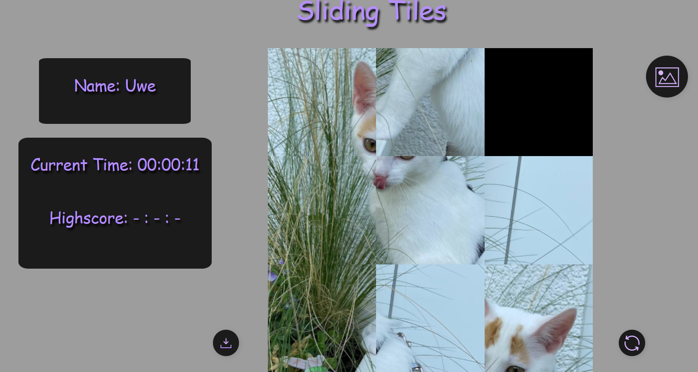
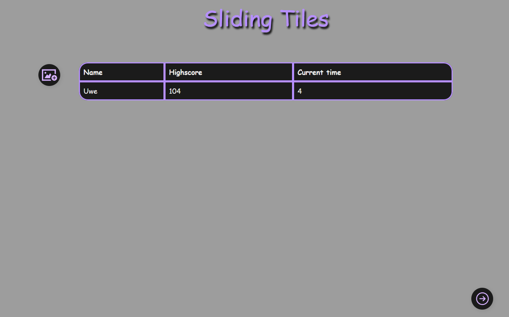

# 🧩 Webentwicklung-Projekt – Schiebepuzzle

## 📖 Projektbeschreibung
Dieses Repository ist die Abgabe für das Modul **Webentwicklung im 2. Semester**.  
Das Projekt beinhaltet ein interaktives **Schiebepuzzle-Spiel**, das mit eigenen Bildern gespielt werden kann.

### 🎮 Funktionsumfang
- Klassisches **Schiebepuzzle-Spiel**
- **Eigene Bilder** können hochgeladen und gespielt werden
- **Zeitmessung** und Speicherung der Bestzeiten (**Highscores**) in einer lokalen Datenbank
- Möglichkeit, das Puzzle auf die **Ausgangsposition** zurückzusetzen

---

## 🗂️ Seitenstruktur

- **Spielseite:**  
  Hier kann das Puzzle gespielt werden. Außerdem werden die gespeicherten Highscores angezeigt.

- **Startseite:**  
  Auf dieser Seite können eigene Bilder **hochgeladen** oder **gelöscht** werden. Zudem werden Bilder, welche bereits in der Datenbak gespeichert sind ausgewählt, weitergespielt oder erneut gespielt werden.

---

## ⚙️ Setup-Anleitung

1. Repository klonen:
2. In der Datei `server/server.js` den Pfad in der Variable pathDb anpassen.
Dieser muss auf den lokalen Pfad zur Datei data.db zeigen.
3. Die Datei `server/server.js` lokal mit NodeJS ausführen.
4. Anschließend die Datei src/start.html im Browser öffnen.

5. Nun können eigene Bilder hochgeladen werden.
Diese werden in der Anwendung angezeigt und können als Puzzle gespielt werden.
Die erzielten Highscores werden lokal gespeichert und beim erneuten Öffnen der Seite automatisch aus der Datenbank geladen.

# 💡 Hinweise

Das Projekt speichert alle Daten lokal – es ist kein externer Server erforderlich.

Für optimale Funktion sollte ein moderner Browser (z. B. Chrome, Firefox, Edge) verwendet werden.

# Bilder der Webseite
### Spiel Seite

    

### Start Seite

    

